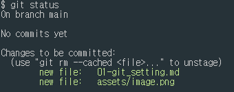

## Git Setup하기
[설치하러가기](https://git-scm.com/)

## Add, Commit, Push, Pull
### 01. Add
먼저, 초기화 선언을 해준다
```bash
git init
# Initialized empty Git repository in D:/Git/.git/
```
폴더 리스트를 확인해 보면 .git (숨김처리된파일)이 생성되어 있다   


새로운 파일을 생성한 후,
```bash
git add <file name> # 단일 파일만 staiging
git add . # 모든 파일 staiging
```


### 02. Commit
```bash
git commit -m "메시지내용"
```


