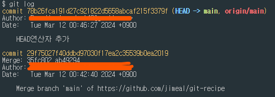

## Add, Commit, Push, Pull
### 01. Add
먼저, 초기화 선언을 해준다
```bash
git init
# Initialized empty Git repository in D:/Git/.git/
```
폴더 리스트를 확인해 보면 .git (숨김처리된파일)이 생성되어 있다   


새로운 파일을 생성한 후,
```bash
git add <file name> # 단일 파일만 staiging
git add . # 모든 파일 staiging
```


### 02. Commit
```bash
git commit -m "메시지내용"
```


### 03. Add와 Commit 한번에 
```bash
git commit -am "메시지내용" 
```
새로 추가된(untracked) 파일이 없을 때 한정


### 04. Push
원격저장소 주소 등록 및 확인 삭제
```bash
git remote add origin 저장소주소.git  # 저장소 등록
git remote -v  # 저장소 확인
git remote rm origin  # 저장소 삭제
git remote remove origin # 저장소 삭제
git remote rename <기존 이름> <변경할 이름>  # 저장소 이름 변경
git remote  # 저장소이름 확인
```
원격저장소로 푸시
```bash
git push -u origin main  
git push --set-upstream origin main 
```
-u 또는 --set-upstream : 현재 브랜치와 명시된 원격 브랜치 기본 연결   

강제푸시
```bash
git push -f
git push --force
```

### 05. pull
```bash
git pull
```
푸시할것이 있을 시 pull하는 두가지 방법
```bash
git pull --no-rebase  # merge방식
git pull --rebase  # rebase 방식
```
### 06. Log, Status
```bash
git log
```
   
```bash
git log --oneline  # 전체 커밋메시지를 한줄로
git log --oneline -n1 # 한개의 커밋메시지를 한줄로 
```