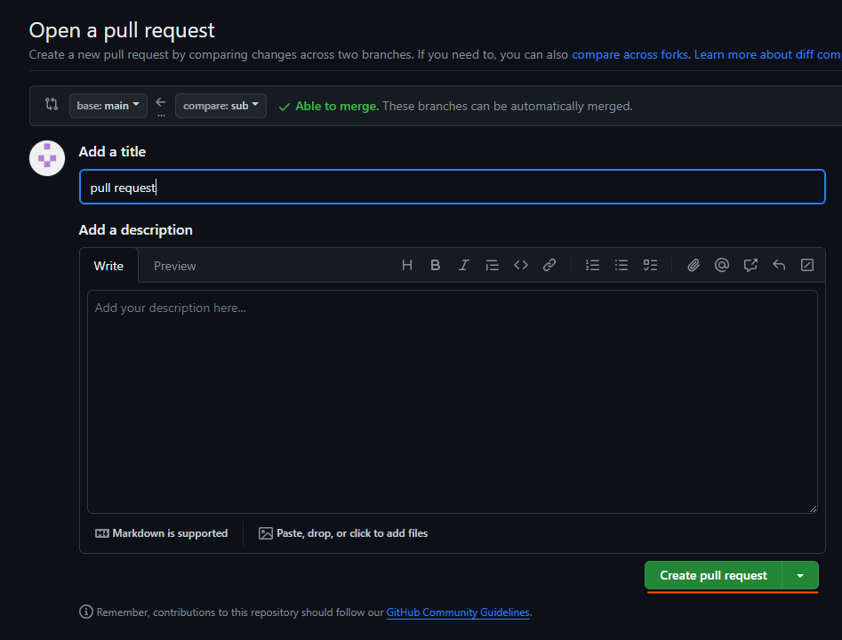
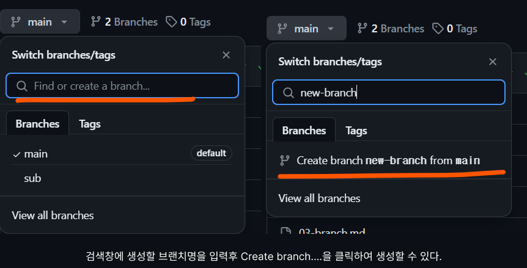
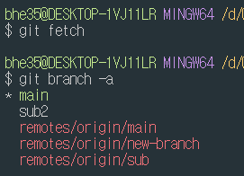

## Branch
브랜치 만들기
```bash
git branch <브랜치명>
git branch sub
```
브랜치 삭제
```bash
git branch -D <브랜치명>
git branch -D sub
```
브랜치명 변경
```bash
git branch -m <브랜치명> <새로운 브랜치명>
git branch -m sub sub2
```
브랜치 이동
```bash
git switch <브랜치명>
git checkout <브랜치명>
git switch sub
git checkout sub
```
브랜치 생성과 이동
```bash
git checkout -b sub
git switch -c sub
```
새로운 내용 추가후 add, commit까지 완료

## Merge
merge를 하기 위해 병합할 브랜치로 이동
```bash
git switch main
```
```bash
git merge <새로만든 브랜치명>
```
log 확인 후 push


## Pull Request
새로운 브랜치에 새로운 내용을 추가 한후 push까지 완료해준다

원격 저장소에 브랜치가 없어 push가 안될경우
```bash
# fatal: The current branch <branch> has no upstream branch.
# To push the current branch and set the remote as upstream, use
git push --set-upstream origin <브랜치명>
```
원격저장소로 이동해보면   


create pull request버튼 클릭   
   


### 원격 브랜치
   

원격 변경사항 확인
```bash
git fetch
git branch --all  # 원격 로컬 모든 브랜치 확인
git branch -a
```
   

로컬에 같은 이름의 브랜치 생성하여 연결하고 이동
```bash
git switch -t origin/브랜치명
git switch -t origin/new-branch
```
원격 브랜치 삭제
```bash
git push (원격 이름) --delete (원격의 브랜치명)
git push origin --delete new-branch
```
